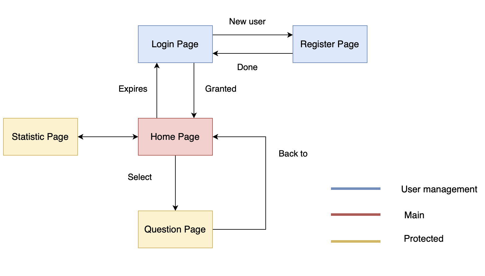
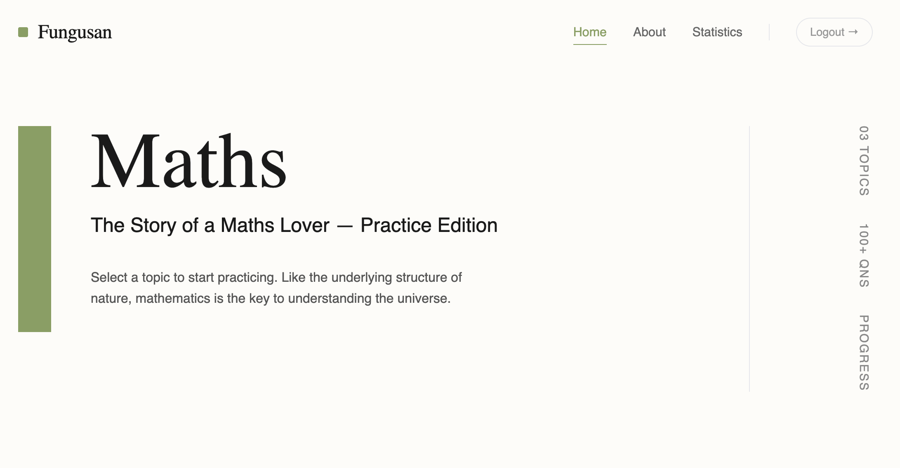
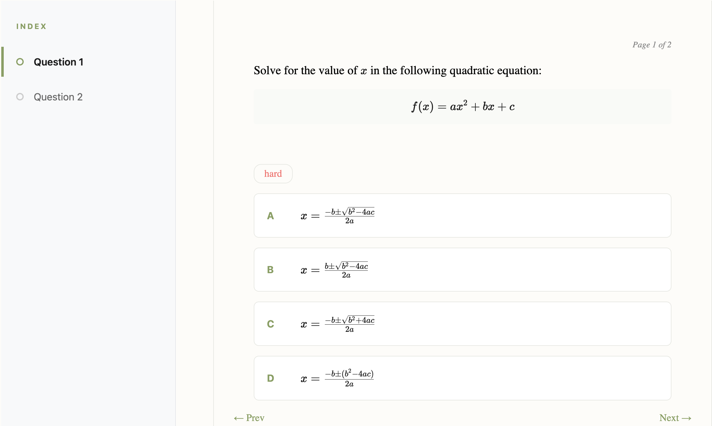
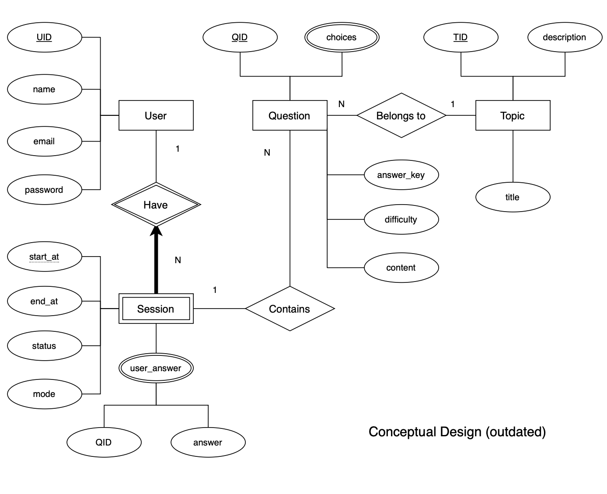
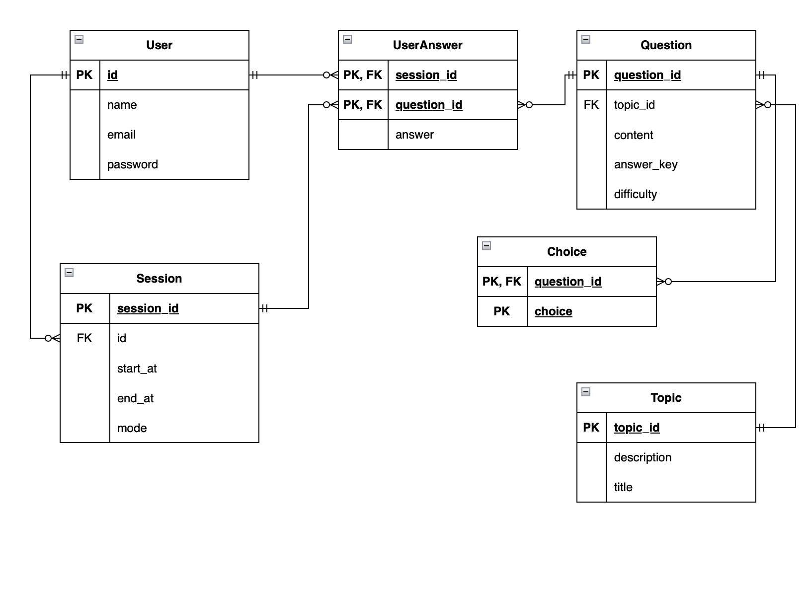

# Fungusan’s Maths Platform

# Features

| Feature Category | Specific Features |
| --- | --- |
| **Core Problem Display** | R1. Render maths problems with formulas
 |
|  | R2. Show multiple choice options
 |
| **Problem Selection** | R3. Topic filtering (trigonometry, geometry, etc.)
 |
|  | R4. Difficulty selection (easy/medium/hard/mixed)
 |
|  | R5. Random problem generation
 |
| **User Progression** | R6. Daily question system & streak tracking
 |
| **Assessment & Feedback** | R7. Answer checking
 |
|  | R8. Completion statistics per problem set
 |
| **User Management** | R9. User accounts/profiles
 |
|  | R10. Login system
 |

# Frontend

## UI Display Logic



<aside>
⚠️ All users will visit the home page, but they must login and grant access token as they visit protected pages

</aside>

## UI Appearance

### Hero Section



### Questions Book Section



<aside>
💡 Style: editorial and book-like; match with my primary portfolio 
</aside>

## Endpoints

| METHOD | PATH | DESCRIPTION |
| --- | --- | --- |
| GET | /users/<:id> | Get user information (e.g. name) |
| POST | /users/login | Log a existing user in, return access token |
| POST | /users/register | Register a new user, and log him/her in |
| POST | /sessions/open | Open a new question session for the chosen topic (query: topic, mode, number) |
| PUT | /sessions/edit | Edit answers to the current session |
| POST | /sessions/submit | Submit answers (mark as complete) |
| GET | /sessions/fetch | Get unfinished session (if any) (prevent multiple sessions, and reload the answers) |
| DELETE | /sessions/delete | Delete the current unfinished session |
| GET | /sessions/stat | Get streak, statistics for previous sessions |
| GET | /questions/topics | Get the list of topics |
| GET | /questions/<:question_slug> | Get a question by question_slug (for showing wrongly answered questions) |

### Users

```json
GET /users/<:id>
// Response
{
  "$schema": "https://json-schema.org/draft/2020-12/schema",
  "type": "object",
  "properties": {
    "id": { "type": "string" },
    "user_name": { "type": "string" },
    "email": { "type": "string", "format": "email" },
    "date_joined": { "type": "string", "format": "date-time" }
  },
  "required": ["id", "name"]
}

POST /users/login
// Request
{
  "$schema": "https://json-schema.org/draft/2020-12/schema",
  "type": "object",
  "properties": {
    "email": { "type": "string", "format": "email" },
    "password": { "type": "string", "minLength": 8 }
  },
  "required": ["email", "password"]
}

// Response
{
  "$schema": "https://json-schema.org/draft/2020-12/schema",
  "type": "object",
  "properties": {
    "token": { "type": "string" },
    "user": {
      "type": "object",
      "properties": {
        "id": { "type": "string" },
        "user_name": { "type": "string" }
      },
      "required": ["id", "name"]
    }
  },
  "required": ["token", "user"]
}

POST /users/register
// Request
{
  "$schema": "https://json-schema.org/draft/2020-12/schema",
  "type": "object",
  "properties": {
    "name": { "type": "string", "minLength": 1 },
    "email": { "type": "string", "format": "email" },
    "password": { "type": "string", "minLength": 8 }
  },
  "required": ["name", "email", "password"]
}

// Response
{
  "$schema": "https://json-schema.org/draft/2020-12/schema",
  "type": "object",
  "properties": {
    "token": { "type": "string" },
    "user": {
      "type": "object",
      "properties": {
        "id": { "type": "string" },
        "user_name": { "type": "string" }
      },
      "required": ["id", "name"]
    }
  },
  "required": ["token", "user"]
}
```

### Sessions

```json
POST /sessions/open
// auth required
// Request
{
  "$schema": "https://json-schema.org/draft/2020-12/schema",
  "type": "object",
  "properties": {
    "mode": { "type": "string" },
    "topic_id": { "type": "string" },
    "difficulty": { "type": "string" },
    "question_count": { "type": "integer", "min": 1, "max": 50}
  },
  "required": ["mode"]
}

// Response
{
  "$schema": "https://json-schema.org/draft/2020-12/schema",
  "type": "object",
  "properties": {
    "session_id": { "type": "string" },
    "questions": {
        "type": "array",
        "items": {
            "type": "object",
            "properties": {
                "question_id": { "type": "string" },
                "content": { "type": "string" },
                "difficulty": { "type": "string" },
                "choices": { "type": "array", "items": { "type": "string" } },
            },
            "required": ["question_id", "content", "difficulty", "choices"]
        }
    }
  },
  "required": ["session_id", "questions"]
}

PUT /sessions/edit
// auth required
// update one answer (to restore answers for unfinished sessions)
// Request
{
  "$schema": "https://json-schema.org/draft/2020-12/schema",
  "type": "object",
  "properties": {
      "session_id": { "type": "string" },
    "question_id": { "type": "string" },
    "answer": { "type": "integer" }
  },
  "required": ["session_id", "question_id", "answer"]
}

POST /sessions/submit
// auth required
// mark as finish (and therefore in stat)
// Request
{
  "$schema": "https://json-schema.org/draft/2020-12/schema",
  "type": "object",
  "properties": {
      "session_id": { "type": "string" },
  },
  "required": ["session_id"]
}

// Response
{
  "$schema": "https://json-schema.org/draft/2020-12/schema",
  "type": "object",
  "properties": {
    "end_at": { "type": "date-time" },
    "questions": {
        "type": "array",
        "items": {
            "type": "string",
            "properties": {
                "wrong_id": { "type": "string" },
            },
            "required": ["wrong_id",]
        }
  },
  "required": []
}

GET /sessions/fetch
// frontend should always check if there are any unfinished sessions before requesting another session
// empty on no unfinished session (user answer optional) real beast
// Response
{
  "$schema": "https://json-schema.org/draft/2020-12/schema",
  "type": "object",
  "properties": {
    "start_at": { "type": "date-time" },
    "questions": {
        "type": "array",
        "items": {
            "type": "object",
            "properties": {
                "question_id": { "type": "string" },
                "content": { "type": "string" },
                "difficulty": { "type": "string" },
                "choices": { "type": "array", "items": { "type": "string" } },
                "answer": { "type": "integer" }
            },
            "required": ["question_id", "content", "difficulty", "choices"]
        }
  },
  "required": []
}

DELETE /sessions/delete
// Request
{
  "$schema": "https://json-schema.org/draft/2020-12/schema",
  "type": "object",
  "properties": {
      "user_id": { "type": "string" },
    "start_at": { "type": "date-time" },
  },
  "required": ["id", "start_at", "question_id", "answer"]
}
```

### Questions

```json
GET /questions/topics
// No auth required
// Response
{
  "$schema": "https://json-schema.org/draft/2020-12/schema",
  "type": "array",
  "items": {
    "type": "object",
    "properties": {
      "topic_id": { "type": "string" },
      "title": { "type": "string" },
      "description": { "type": "string" },
    },
    "required": ["topic", "description"]
  }
}

GET /questions/<:question_slug>
// auth required
{
  "$schema": "https://json-schema.org/draft/2020-12/schema",
  "type": "object",
  "properties": {
    "content": { "type": "string" },
    "difficulty": { "type": "string" },
    "choices": { "type": "array", "items": { "type": "string" } },
  },
  "required": ["content", "difficulty"]
}
```

# Backend

## ER Diagram



## Relational Diagram



### Some SQL Notes

```sql
-- Get a list of wrong question_id for the current session ($session_test)
SELECT q.question_id 
FROM Session s 
JOIN UserAnswer ua ON s.session_id = ua.session_id
JOIN Question q ON ua.question_id = q.question_id
WHERE s.session_id = $session_test
  AND ua.answer <> q.answer_key;
```